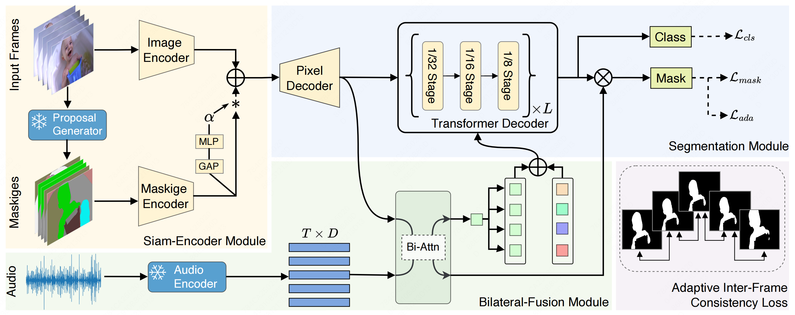

<p align="center">
  

<h1 align="center">COMBO-AVS</h1>
</p>

# [Cooperation Does Matter: Exploring Multi-Order Bilateral Relations for Audio-Visual Segmentation](https://yannqi.github.io/AVS-COMBO/)

[Qi Yang](https://yannqi.github.io/), Xing Nie, Tong Li, Pengfei Gao, Ying Guo, Cheng Zhen, Pengfei Yan and [Shiming Xiang](https://people.ucas.ac.cn/~xiangshiming)

This repository provides the PyTorch implementation for the paper "Cooperation Does Matter: Exploring Multi-Order Bilateral Relations for Audio-Visual Segmentation" accepted by CVPR 2024 (Highlight).

## 🔥What's New

- (2024. 4.06) Our paper(COMBO) is marked as Highlight Paper! 😮
- (2024. 3.19) Our checkpoints are available to the public, looking from [YannQi/COMBO-AVS-checkpoints · Hugging Face](https://huggingface.co/YannQi/COMBO-AVS-checkpoints)!
- (2024. 3.14) Our code is available to the public in $\pi$ day!
- (2024. 3.12) Our code is ready to share for the public 🌲🌲🌲!
- (2024. 2.27) Our paper(COMBO) is accepted by CVPR 2024!
- (2023.11.17) We completed the implemention of COMBO and push the code.

## 🪵 TODO List

- [X] Upload the pre-masks and the checkpoints at the [YannQi/COMBO-AVS-checkpoints · Hugging Face](https://huggingface.co/YannQi/COMBO-AVS-checkpoints)!

## 📚Method

<p align="center">
  

<h6 align="center">Overview of the proposed COMBO.</h6>
</p>

## 🛠️ Getting Started

### 1. Environments

- Linux or macOS with Python ≥ 3.6

```shell
# recommended
pip install -r requirements.txt
pip install soundfile
# build MSDeformAttention
cd models/modeling/pixel_decoder/ops
sh make.sh
```

- Preprocessing for detectron2

  For using Siam-Encoder Module (SEM), we refine 1-line code of the detectron2.

  The refined file that requires attention is located at:

  `conda_envs/xxx/lib/python3.xx/site-packages/detectron2/checkpoint/c2_model_loading.py`
  (refine the `xxx`  to your own environment)

  Commenting out the following code in [L287](https://github.com/facebookresearch/detectron2/blob/cc9266c2396d5545315e3601027ba4bc28e8c95b/detectron2/checkpoint/c2_model_loading.py#L287) will allow the code to run without errors:

```python
# raise ValueError("Cannot match one checkpoint key to multiple keys in the model.")  
```

- Install Semantic-SAM (Optional)

```shell
# Semantic-SAM
pip install git+https://github.com/cocodataset/panopticapi.git
git clone https://github.com/UX-Decoder/Semantic-SAM
cd Semantic-SAM
python -m pip install -r requirements.txt
```

Find out more at [Semantic-SAM](https://github.com/UX-Decoder/Semantic-SAM)

### 2. Datasets

Please refer to the link [AVSBenchmark](https://github.com/OpenNLPLab/AVSBench) to download the datasets. You can put the data under `data` folder or rename your own folder. Remember to modify the path in config files. The `data` directory is as bellow:

```
|--AVS_dataset
   |--AVSBench_semantic/
   |--AVSBench_object/Multi-sources/
   |--AVSBench_object/Single-source/
```

Preprocess the AVSS dataset for efficient training.

```shell
python3 avs_tools/preprocess_avss_audio.py
python3 avs_tools/process_avssimg2fixsize.py
```

### 3. Download Pre-Trained Models

- The pretrained backbone is available from benchmark AVSBench pretrained backbones [YannQi/COMBO-AVS-checkpoints · Hugging Face](https://huggingface.co/YannQi/COMBO-AVS-checkpoints).

```
|--pretrained
   |--detectron2/R-50.pkl
   |--detectron2/d2_pvt_v2_b5.pkl
   |--vggish-10086976.pth
   |--vggish_pca_params-970ea276.pth
```

### 4. Maskiges pregeneration

- Generate class-agnostic masks (Optional)

```shell
sh avs_tools/pre_mask/pre_mask_semantic_sam_s4.sh train # or ms3, avss
sh avs_tools/pre_mask/pre_mask_semantic_sam_s4.sh val 
sh avs_tools/pre_mask/pre_mask_semantic_sam_s4.sh test
```

- Generate Maskiges (Optional)

```shell
python3 avs_tools/pre_mask2rgb/mask_precess_s4.py --split train # or ms3, avss
python3 avs_tools/pre_mask2rgb/mask_precess_s4.py --split val
python3 avs_tools/pre_mask2rgb/mask_precess_s4.py --split test
```

- Move Maskiges to the following folder
  Note: For convenience, we provide pre-generated Maskiges for S4\MS3\AVSS subset on the [YannQi/COMBO-AVS-checkpoints · Hugging Face](https://huggingface.co/YannQi/COMBO-AVS-checkpoints).

```
|--AVS_dataset
    |--AVSBench_semantic/pre_SAM_mask/
    |--AVSBench_object/Multi-sources/ms3_data/pre_SAM_mask/
    |--AVSBench_object/Single-source/s4_data/pre_SAM_mask/
```

### 5. Train

```shell
# ResNet-50
sh scripts/res_train_avs4.sh # or ms3, avss
```

```shell
# PVTv2
sh scripts/pvt_train_avs4.sh # or ms3, avss
```

### 6. Test

```shell
# ResNet-50
sh scripts/res_test_avs4.sh # or ms3, avss
```

```shell
# PVTv2
sh scripts/pvt_test_avs4.sh # or ms3, avss
```

### 7. Results and Download Links

We provide the checkpoints of the S4 Subset at [YannQi/COMBO-AVS-checkpoints · Hugging Face](https://huggingface.co/YannQi/COMBO-AVS-checkpoints).

|   Method   | Backbone | Subset |                      Config                      | mIoU | F-score |
| :---------: | :-------: | :----: | :-----------------------------------------------: | :--: | :-----: |
|  COMBO-R50  | ResNet-50 |   S4   |   [config](configs/avs_s4/COMBO_R50_bs8_90k.yaml)   | 81.7 |  90.1  |
| COMBO-PVTv2 | PVTv2-B5 |   S4   | [config](configs/avs_s4/COMBO_PVTV2B5_bs8_90k.yaml) | 84.7 |  91.9  |
|  COMBO-R50  | ResNet-50 |  MS3  |   [config](configs/avs_ms3/COMBO_R50_bs8_20k.yaml)   | 54.5 |  66.6  |
| COMBO-PVTv2 | PVTv2-B5 |  MS3  | [config](configs/avs_ms3/COMBO_PVTV2B5_bs8_20k.yaml) | 59.2 |  71.2  |
|  COMBO-R50  | ResNet-50 |  AVSS  |   [config](configs/avs_ss/COMBO_R50_bs8_90k.yaml)   | 33.3 |  37.3  |
| COMBO-PVTv2 | PVTv2-B5 |  AVSS  | [config](configs/avs_ss/COMBO_PVTV2B5_bs8_90k.yaml) | 42.1 |  46.1  |

## 🤝 Citing COMBO

```
@misc{yang2023cooperation,
      title={Cooperation Does Matter: Exploring Multi-Order Bilateral Relations for Audio-Visual Segmentation},
      author={Qi Yang and Xing Nie and Tong Li and Pengfei Gao and Ying Guo and Cheng Zhen and Pengfei Yan and Shiming Xiang},
      year={2023},
      eprint={2312.06462},
      archivePrefix={arXiv},
      primaryClass={cs.CV}
}
```
